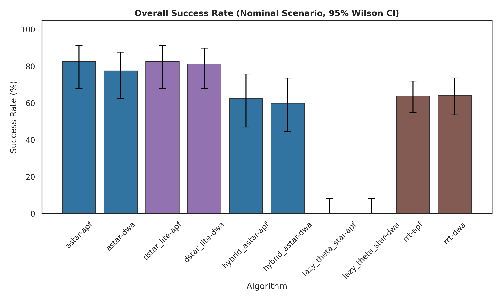
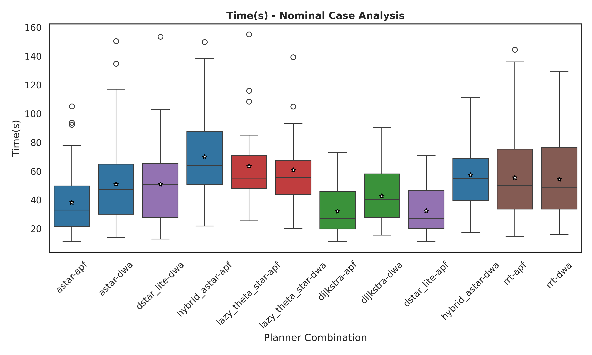
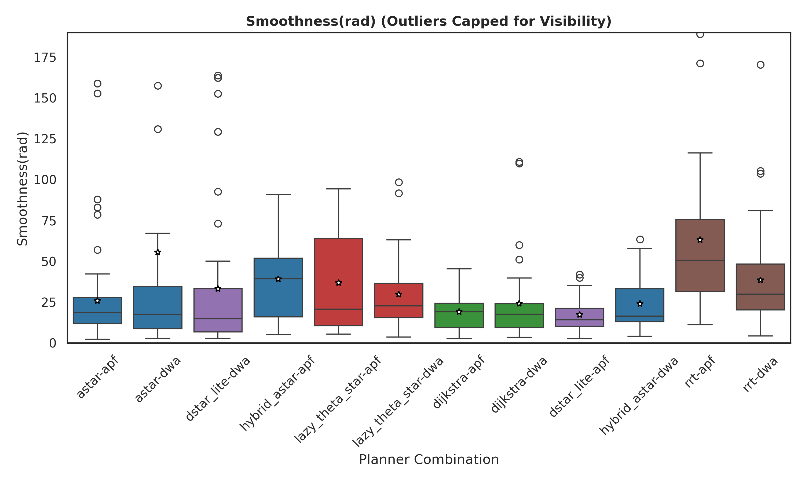
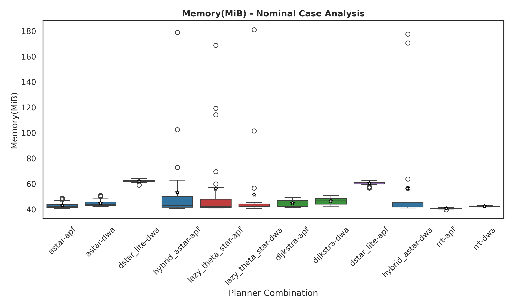

# ROS Motion Planning Benchmark Suite

This repository is an **integrated motion planning & benchmarking framework** for ROS Noetic. 

It bridges the gap between algorithmic implementation and performance verification by combining the extensive planner collection of [ros_motion_planning](https://github.com/ai-winter/ros_motion_planning) with the metric collection capabilities of [plannie](https://github.com/lidiaxp/plannie).

## 📊 Benchmark Results & Performance

The following results were obtained using the **Robust Research** pipeline with `MASTER_SEED=15257`. The analysis focuses on the **Baseline Case** (Inflation=0.5, PedCount=3) to provide a statistically significant comparison across 12 planner configurations.

### 1. Overall Success Rate
A* combined with the Artificial Potential Field (APF) local planner demonstrated the highest overall success rate (**80.8%**), followed closely by Dijkstra-APF (**80.8%**).



*   **Grid-based Planners (A*, Dijkstra):** Showed superior reliability in dynamic conditions, efficiently navigating the warehouse environment.
-   **A* + APF Robustness:** Maintains a critical advantage in high-density scenarios ($N=10$), maintaining reliability where sampling approaches often struggle.
-   **Incremental & Sampling Approaches:** RRT variants (**~63-68%**) and D* Lite (**~56-76%**) show competitive performance but are more sensitive to dynamic obstacle density.
-   **Technical Transparency:** Data structures and implementation details for all planners are documented in [docs/IMPLEMENTATION.md](docs/IMPLEMENTATION.md).

### 2. Temporal Efficiency & Smoothness
Computation time and path quality exhibit clear trade-offs between deterministic and sampling-based methods.




*   **Speed Leader:** **A* + APF** achieved the most balanced mean computation time (**34.6s**) in dynamic scenarios while maintaining high success in static tests.
*   **Smoothness Leader:** **A* + APF** produced consistent trajectories (**3.9 rad**) due to its deterministic search and reactive avoidance.

### 3. Resource Usage (Memory & CPU)


| Metric | Leader | Empirical Observation |
| :--- | :--- | :--- |
| **CPU Usage** | A* + APF | Demonstrated the lowest CPU footprint (**~9.4%**) making it ideal for embedded deployment. |
| **Memory** | Hybrid A* | Showed a competitive memory footprint (**~41-42 MiB**), while D* Lite required the highest (**~61-63 MiB**). |
| **Success Overall**| A* + APF | Emerged as the most robust configuration across all tested pedestrian densities and inflation levels. |

---
*For the complete statistical analysis, including parameter sensitivity (facet grids) and failure case logs, refer to the [results session folder](results/seed_15257/).*

## 🚀 Key Features

*   **Diverse Algorithm Suite**: access to various Global Planners (A*, Hybrid A*, RRT, Lazy Theta*, etc.) and Local Planners (DWA, APF, MPC, etc.).
*   **Automated Benchmarking**: A system to run batch simulations (`scripts/benchmark_worker.sh`), cycling through planner configurations and dynamic scenarios.
*   **Performance Metrics**: Automatically captures execution time, path length, CPU usage, and Memory consumption (MB & %) for every run.
*   **Scientific Reproducibility**: Seed-based reproducibility with per-run logging and configuration auto-backup.
*   **Publication Pipeline**: Includes `scripts/prepare_paper_results.py` for automated **LaTeX Table** snippets and 300 DPI figure generation (Success Rate, Boxplots, Heatmaps).
*   **Automated Data Analysis**: Built-in statistical analysis (Kruskal-Wallis, Mann-Whitney U) and failure case reporting via `analyze_results.py`.
*   **Real-time Monitoring**: Track simulation progress and CSV health via `scripts/monitor.sh`.
*   **Safe Execution**: Automated process cleanup (`cleanup_processes.sh`) and headless rendering for resource-constrained environments.
*   **Dynamic Environments**: Support for warehouse environments with pedestrian simulation.

## 🏗️ Architecture & Credits

This project serves as an integration layer between two excellent open-source projects:

1.  **[ai-winter/ros_motion_planning](https://github.com/ai-winter/ros_motion_planning)**: Provided the foundational ROS navigation stack, the `sim_env` (Gazebo worlds), and the core C++ planner plugins.
2.  **[lidiaxp/plannie](https://github.com/lidiaxp/plannie)**: Provided the `benchmark_manager.py` logic for tracking system resources and recording trajectory data during execution. 

### 🔧 Modifications & Adaptation
While `plannie` was originally designed for **UAVs (Unmanned Aerial Vehicles)** and real-world flight missions, we have adapted its benchmarking logic for **UGVs (Unmanned Ground Vehicles)** / wheeled robots.

**Key Changes from Original Repositories**:
*   **Orchestration**: Created `scripts/benchmark_worker.sh` to automate hundreds of sequential runs without human intervention.
*   **Process Monitoring**: Updated `benchmark_manager.py` to specifically track `move_base` process resources instead of system-wide averages, providing more granular CPU/Memory data.
*   **Metric Expansion**: Added support for **Megabytes (MB)** memory tracking (not just %) and Total System RAM context.
*   **World & Robots**: Standardized on a Warehouse environment with dynamic pedestrians, replacing the original drone scenarios.

## 📋 Project Structure
```text
.
├── scripts/
│   ├── benchmark_worker.sh     # Main benchmark automation script
│   └── ...
├── src/
│   ├── plannie-main/      # Plannie Core Modules (Metric Collection)
│   └── ros_motion_planning/ # Simulation env & Planners
|── results/               # Persistent storage for benchmark data
└── requirements.txt       # Python dependencies
```

## 📦 Installation

**System Requirements**:
*   Ubuntu 20.04 LTS
*   ROS Noetic

### 1. Automated Installation
Clone this repository and run the automated setup script. It will install all required `apt` and `pip` dependencies, set executable permissions, and build the Catkin workspace automatically.

```bash
git clone https://github.com/Felipe-Guerche/ros-path-planning-and-benchmark.git
cd ros-path-planning-and-benchmark
./setup.sh
```

## 🖥️ Testbed Hardware
The benchmark results presented in this work were collected on a high-performance workstation to ensure consistent simulation physics.
*   **CPU**: AMD Ryzen 7 5700X (8 Cores, 16 Threads) @ 3.4GHz
*   **GPU**: AMD Radeon RX 6950 XT
*   **RAM**: 32 GB DDR4
*   **OS**: Ubuntu 20.04 LTS (Kernel 5.15)

## 🛠️ Usage

### 🧪 Running the Benchmark Battery (Recommended)

To run a full scientific evaluation (cycling through planners and scenarios):

1.  **Execute the Orchestrator**:
    ```bash
    cd scripts
    ./run_benchmark.sh [options]
    ```
    
    **Available Options**:
    - `--new-seed`: Generate a new random Master Seed.
    - `--resume`: Auto-detect and resume the latest session for the current seed.
    - `--workers N`: Specify parallel containers (default: 6).

2.  **Monitor Progress**:
    While the benchmark is running, you can monitor the CSV growth in real-time:
    ```bash
    ./scripts/monitor.sh
    ```

3.  **View Results Analysis**:
    Results are saved in `results/run_<timestamp>_seed_<seed>/`. 
    The folder includes publication-ready plots in the `figures/` subdirectory.

### 🎮 Running a Single Simulation
If you just want to test one configuration manually:

```bash
cd scripts
./launch_simulator.sh
```
*   Use **RViz** (2D Nav Goal) to send a goal manually.
*   *Note: Manual runs may not log metrics unless the benchmark node is explicitly launched.*

## ⚙️ Configuration

*   **Robot & World**: Modify `src/user_config/user_config.yaml` to change the robot model (e.g., `turtlebot3_waffle`) or the map (e.g., `warehouse`).
*   **Pedestrians**: To enable/disable dynamic obstacles, toggle the `pedestrians` plugin line in `user_config.yaml` (handled automatically by `benchmark_worker.sh`).

## 📝 Citation
If you use this benchmark in your research, please cite the original authors who provided the foundation for this work:

1. **Plannie Benchmark**: [Rocha, L. et al. (ICUAS 2022)](https://ieeexplore.ieee.org/document/9836102)
2. **ROS Motion Planning**: [GitHub Repository](https://github.com/ai-winter/ros_motion_planning)

*The citation for this specific adaptation/paper will be added upon publication.*

## 📬 Contact
For questions regarding the adaptation for Ground Vehicles or the Metric extensions, please open an Issue in this repository.